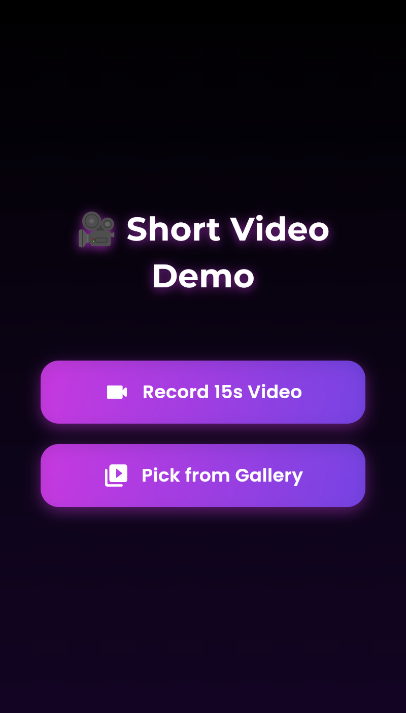

# 🎥 Flutter Short Video App

> A sleek, modern Flutter app to record 15-second videos or pick videos from your gallery, trim them, and preview with real-time playback. Inspired by TikTok and Instagram Reels.


---

## 🌟 Features

- Record **15-second short videos** with a circular countdown button.
- Pick videos from your gallery and **trim to 15 seconds**.
- Real-time video **preview playback**.
- **Modern UI/UX**: animated gradient waves, floating particles, glassmorphic buttons.
- Dark mode with **Google Fonts** (Montserrat & Poppins) for premium feel.
- Fully **open-source** and ready for contributions.

---

## 📸 Screenshots

| Home | Record Page | Pick & Trim |
|------|------------|------------|
|  |  |  |

---

## 🎬 Demo GIFs

| Home Animation | Recording | Picking & Trimming |
|----------------|----------|------------------|
|  |  |  |

---

## 🚀 Getting Started

1. **Clone the repo**
```bash
git clone https://github.com/your-username/flutter_video_record_gallery.git
cd flutter_video_record_gallery
flutter pub get
flutter run
```

2.  **Tech Stack**
	•	Flutter & Dart
	•	Packages: camera, image_picker, video_trimmer, video_player, path_provider, google_fonts

⸻

3. **Contributing**
	•	Fork the repo
	•	Make your feature branch: git checkout -b feature/my-feature
	•	Commit your changes: git commit -m 'Add feature'
	•	Push to the branch: git push origin feature/my-feature
	•	Open a pull request

⸻

📝 License

MIT License © 2025
Feel free to fork, modify, and share ❤️
